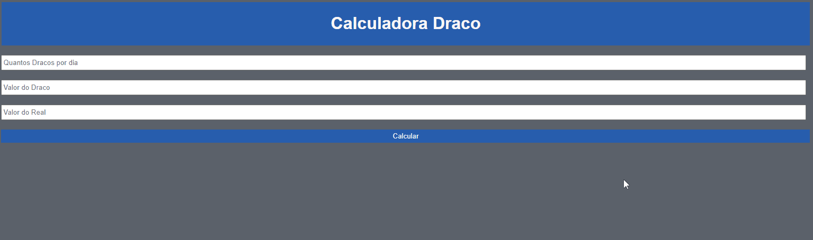

# calculadora-draco
Calculadora de lucros com a criptomoeda Draco

O usuário insere a quantidade de Dracos que consegue forjar por dia, em seguida a cotação do Draco em USD e logo após a cotação do BRL, a calculadora mostra o resultado diário e mensal em reais

Tecnologias utilizadas no projeto:
<ul>
  <li>HTML</li>
  <li>CSS</li>
  <li>JavaScript</li>
</ul>

Link para o site: https://arthur-albuquerque1.github.io/calculadora-draco/
